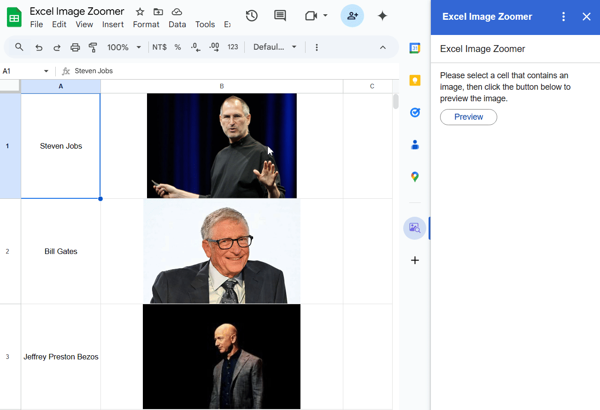

# Excel Image Zoomer

A lightweight Google Workspace™ add-on that lets you click and enlarge images directly from your spreadsheet cells.  
Easy to use, no extra setup required.

> **🚀 v1.3.0 Update:** Now supports **"One-Click Preview"**! Simply click the button over any image to pop it up instantly.

## Features

- 📷 Click any cell image to view it in full size
- 🔍 Simple and intuitive UI
- ⚡️ Works seamlessly with Google Sheets™ (and Excel in the future)
- 🖼️ Supports multiple images per sheet

## Installation

1. Go to the [Google Workspace™ Marketplace](https://workspace.google.com/marketplace).
2. Search for **Excel Image Zoomer**.
3. Click **Install** and follow the instructions.

## How to Use

1. Insert images into your spreadsheet cells.
2. Click an image thumbnail to enlarge it.
3. Click outside the image to close the zoom view.
